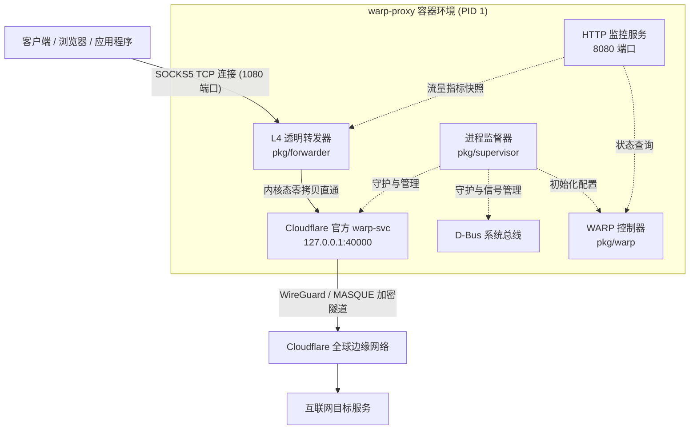

<p align="center">
  <a href="https://github.com/riba2534/warp-proxy">
    
  </a>
</p>

<h1 align="center">warp-proxy</h1>

<p align="center">
  <strong>高性能、轻量级的 Cloudflare WARP SOCKS5 代理服务</strong>
  <br />
  容器化运行 Cloudflare 官方 WARP 客户端，并通过原生 L4 传输层零拷贝暴露标准 SOCKS5 代理服务。
</p>

<p align="center">
  <a href="https://hub.docker.com/r/riba2534/warp-proxy"></a>
  <a href="https://github.com/riba2534/warp-proxy/actions/workflows/docker-publish.yml"></a>
  
  
  <a href="LICENSE"></a>
</p>

<p align="center">
  <a href="#warp-proxy-是什么">介绍</a> ·
  <a href="#功能总览">功能总览</a> ·
  <a href="#系统架构">系统架构</a> ·
  <a href="#快速开始">快速开始</a> ·
  <a href="#配置说明">配置说明</a> ·
  <a href="#监控与健康检查">监控与探针</a> ·
  <a href="#开发与测试">开发与测试</a>
</p>

---

## warp-proxy 是什么

`warp-proxy` 是一个极简、高性能的 Cloudflare WARP 容器化 SOCKS5 代理服务。它将 Cloudflare 官方 Linux 客户端封装在轻量容器中，并通过 Go 编写的原生 L4 传输层网桥对外暴露标准的 SOCKS5 代理接口（默认 `1080` 端口）。

不同于传统的应用层二次重包方案，`warp-proxy` 采用四层纯透明直通管道，客户端与官方 WARP 守护进程之间的数据流原汁原味透传，完整支持 IPv4、IPv6 裸 IP 直连以及域名解析访问。在 Linux 环境下自动启用 `splice(2)` 内核级零拷贝，具备极致吞吐与超低资源消耗。

服务内置单一 Go 二进制作为容器 PID 1 Supervisor，负责 D-Bus 与官方 `warp-svc` 守护进程的自启动、自动注册建连、双模式健康检查及优雅停机，开箱即用。

## 功能总览

| 模块 | 主要能力 |
| --- | --- |
| **标准 SOCKS5 服务** | 默认监听 `0.0.0.0:1080`，提供标准 RFC 1928 SOCKS5 代理接口，支持 IPv4、IPv6 裸地址直连与域名访问 |
| **L4 零拷贝透明转发** | 传输层双向直通，无应用层协议拆包与篡改；Linux 下自动通过 `splice(2)` 进行内核级零拷贝数据转发 |
| **TCP 连接优化** | 默认开启 TCP NoDelay（禁用 Nagle 算法降低交互时延）与 TCP KeepAlive，支持 TCP 半关闭（Half-close）优雅断开 |
| **WARP 自动管理** | 容器内自动准备 D-Bus 环境并拉起官方 `warp-svc`，自动判断注册状态、配置代理模式并接入 Cloudflare 边缘网络 |
| **WARP+ 密钥支持** | 支持通过环境变量 `WARP_LICENSE_KEY` 绑定许可密钥，无缝切换为 WARP+ 网络出口 |
| **多架构原生镜像** | 官方镜像原生支持 `linux/amd64` 与 `linux/arm64` 双架构，覆盖常见云服务器与 ARM 开发板 |
| **双模式健康监控** | 提供独立 HTTP 端口（默认 `8080`）的 `/healthz` 探活与 `/status` 运行指标，并自带命令行健康检查探针 |
| **容器生命周期治理** | 单一 Go 二进制充当容器 PID 1 主管，监听捕获 `SIGTERM`/`SIGINT` 信号，按序优雅关闭网络与子进程 |

## 系统架构



## 快速开始

### 1. 使用 Docker Compose（推荐）

创建 `docker-compose.yml`：

```yaml
version: "3.8"

services:
  warp-proxy:
    image: riba2534/warp-proxy:latest
    container_name: warp-proxy
    restart: always
    cap_add:
      - NET_ADMIN
    devices:
      - /dev/net/tun
    ports:
      # SOCKS5 代理端口
      - "1080:1080"
      # HTTP 监控与健康检查端口（可选）
      - "8080:8080"
    environment:
      - WARP_PROXY_PORT=1080
      - WARP_SVC_PORT=40000
      # 如有 WARP+ 许可证可填入，普通免费版留空即可
      - WARP_LICENSE_KEY=
      - HEALTH_PORT=8080
      - LOG_LEVEL=info
    volumes:
      # 持久化注册数据，防止容器重建后重复注册新设备
      - ./warp-data:/var/lib/cloudflare-warp
    healthcheck:
      test: ["CMD", "/usr/local/bin/warp-proxy", "-healthcheck"]
      interval: 30s
      timeout: 5s
      start_period: 15s
      retries: 3
```

启动服务：

```bash
docker compose up -d
```

### 2. 使用 Docker CLI 运行

```bash
docker run -d \
  --name warp-proxy \
  --restart always \
  --cap-add=NET_ADMIN \
  --device /dev/net/tun \
  -p 1080:1080 \
  -p 8080:8080 \
  -v ./warp-data:/var/lib/cloudflare-warp \
  riba2534/warp-proxy:latest
```

### 3. 连接与使用示例

服务启动后，即可通过任意支持标准 SOCKS5 协议的客户端连接：

```bash
# 使用 curl 验证代理连通性
curl -x socks5h://127.0.0.1:1080 https://cloudflare.com/cdn-cgi/trace

# 或在当前终端设置全局代理环境变量
export ALL_PROXY=socks5://127.0.0.1:1080
```

## 配置说明

支持通过环境变量调整各项运行时参数：

| 环境变量 | 默认值 | 说明 |
| :--- | :--- | :--- |
| `WARP_PROXY_HOST` | `0.0.0.0` | 外部 SOCKS5 代理服务的监听地址 |
| `WARP_PROXY_PORT` | `1080` | 外部 SOCKS5 代理服务的暴露端口 |
| `PORT` | `1080` | 端口兼容配置（若未显式指定 `WARP_PROXY_PORT` 时生效） |
| `WARP_SVC_HOST` | `127.0.0.1` | 内部 `warp-svc` 代理服务绑定的地址 |
| `WARP_SVC_PORT` | `40000` | 内部 `warp-svc` SOCKS5 监听的端口号 |
| `WARP_LICENSE_KEY` | *(空)* | 可选，Cloudflare WARP+ 账户许可密钥 |
| `HEALTH_HOST` | `0.0.0.0` | HTTP 健康检查与监控服务的监听地址 |
| `HEALTH_PORT` | `8080` | HTTP 健康检查与监控服务的端口（设为 `0` 时禁用） |
| `DISABLE_HEALTH_SERVER` | `false` | 设置为 `true` 时彻底停用 HTTP 监控服务 |
| `CONNECT_TIMEOUT` | `60s` | 等待 WARP 隧道建连的最长超时时间 |
| `HEALTHCHECK_TIMEOUT` | `10s` | 每次执行网络连通性探测的超时阈值 |
| `LOG_LEVEL` | `info` | 日志输出级别 (`debug`, `info`, `warn`, `error`) |

## 监控与健康检查

### 1. HTTP `/healthz` 端点
适合接入 Kubernetes 存活/就绪探针或外部健康检查平台：
```bash
curl -i http://127.0.0.1:8080/healthz
```
- 正常响应：`HTTP 200 OK`，正文为 `OK`。
- 异常响应：`HTTP 503 Service Unavailable`，附带具体的错误原因。

### 2. HTTP `/status` 端点
获取服务运行健康状态、Cloudflare WARP 边缘接入诊断以及实时流量指标：
```bash
curl -s http://127.0.0.1:8080/status | jq .
```
**响应示例**：
```json
{
  "status": "healthy",
  "timestamp": "2026-09-05T21:21:16Z",
  "warp_status": "Status update: Connected",
  "trace_result": {
    "healthy": true,
    "trace_warp": "on",
    "external_ip": "104.28.238.115",
    "colo": "KIX",
    "trace_details": {
      "colo": "KIX",
      "fl": "594f124",
      "h": "1.1.1.1",
      "http": "http/1.1",
      "ip": "104.28.238.115",
      "loc": "JP",
      "tls": "TLSv1.3",
      "warp": "on"
    },
    "check_duration_ms": 207894445
  },
  "forwarder_stats": {
    "uptime_seconds": 360,
    "active_connections": 2,
    "total_connections": 184,
    "bytes_received": 1048576,
    "bytes_sent": 4194304
  }
}
```

### 3. 原生命令行探针

Docker 镜像已配置原生 `HEALTHCHECK` 探针，执行时不依赖系统外部工具（无需安装 curl 或 wget）：

```bash
docker exec warp-proxy /usr/local/bin/warp-proxy -healthcheck
# 输出示例: [HEALTHCHECK OK] warp=on, ip=104.28.238.115, colo=KIX (duration: 207ms)
```

## 开发与测试

本项目采用标准 Go 开发规范，依赖少且结构清晰：

```bash
# 运行单元测试（包含数据竞态检测）
go test -v -race ./...

# 编译本地二进制
go build -o bin/warp-proxy ./cmd/warp-proxy

# 构建本地 Docker 镜像
docker build -t warp-proxy:latest .
```

## 开源许可证

本项目采用 [MIT 许可证](LICENSE) 开源。
